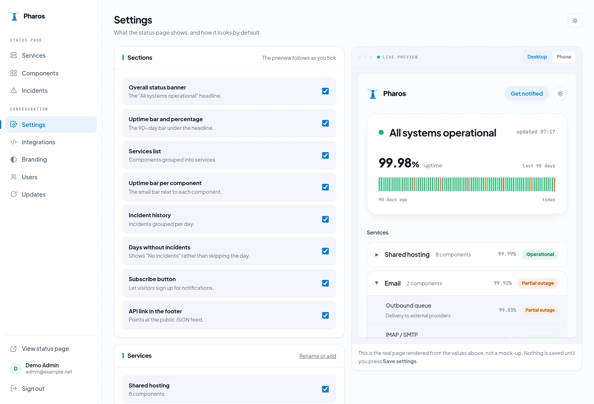

<p align="center">
  
</p>

<p align="center">
  <a href="LICENSE"></a>
  
  
  
  
</p>

# Pharos

**A self-hosted status page that runs its own checks.**

Every status page you know waits for a human to notice. Pharos polls HTTP endpoints and TCP
ports, listens for heartbeats from jobs it cannot see from outside, and sets component status
without anyone pressing a button. A failing check opens an incident and posts the first update;
a recovered check closes it and posts the closing update.

It runs on PHP 8.3 with SQLite — which means the shared cPanel account you already pay for,
not a VPS.

---

## Why it exists

- **Cachet 2.x has had no release since 2021.** Nothing checks anything: a component turns red
  because a person made it red, so it is usually still green while the site is down.
- **Cachet 3.x is no longer open source.** Its licence forbids removing its notices and forbids
  distributing it as a standalone product — which rules it out for anyone reselling hosting.
- **One incident, one component.** A hypervisor failure that takes down four customer sites gets
  logged four times, or once while ignoring three of them.

Pharos speaks the Cachet 2.x API on purpose, so scripts written against Cachet keep working.

---

## What it looks like


<em>The public page. Every section on it is a switch in Settings.</em>


<em>Components. The tiles answer “what is wrong right now” before the table does — including how
many components still rely on someone noticing.</em>



<em>Settings. Tick a section off and it disappears from the preview beside it — the real page,
rendered from values you have not saved yet.</em>

---

## Install

### Shared hosting (cPanel)

Requires PHP 8.3 or later with the usual Laravel extensions, and either SQLite or MySQL.
No daemon, no worker queue, no root.

```bash
# 1. upload or clone into a directory outside public_html
git clone https://github.com/solutionmax/pharos.git ~/pharos
cd ~/pharos

# 2. dependencies
composer install --no-dev --optimize-autoloader

# 3. configuration
cp .env.example .env
php artisan key:generate
touch database/database.sqlite
php artisan migrate --force

# 4. your first administrator
php artisan pharos:user you@example.com

# 5. point the document root at ~/pharos/public
```

Then add **one** cron entry. This is the entire scheduler:

```
* * * * * cd ~/pharos && php artisan schedule:run
```

In cPanel's cron form the first five stars go in the schedule fields and the rest in the
command field.

### Docker

```bash
git clone https://github.com/solutionmax/pharos.git
cd pharos
cp .env.docker.example .env
docker compose up -d
```

Two containers: the application on `php:8.3-apache`, and a second one running
`php artisan schedule:work`. The database is SQLite on a volume by default; point
`DB_CONNECTION` at MySQL if you prefer.

### Check it is alive

```bash
php artisan pharos:check --force
```

Runs every enabled check immediately and prints what it found, instead of waiting for the
scheduler.

---

## How checks work

| Type | What it does | Good for |
|---|---|---|
| **HTTP** | Requests a URL, expects a status code | Websites, APIs, control panels |
| **TCP** | Opens a socket to host:port | Mail, databases, anything without HTTP |
| **Heartbeat** | Waits for *your* job to call in — silence is the failure | Backups, cron scripts, anything you cannot poll from outside |

A check has to fail twice before the component goes red, and has to succeed three times in a row
before the incident closes. That is deliberate: one dropped packet should not publish an outage.

---

## Connecting it to what you already run

The API is **Cachet 2.x compatible**: same endpoints, same status integers, and
`X-Cachet-Token` accepted alongside `Authorization: Bearer`.

```bash
curl -X POST https://status.example.com/api/v1/incidents \
  -H "Authorization: Bearer $TOKEN" \
  -d '{
        "template":   "server-unreachable",
        "vars":       { "server": "web-06.example.net" },
        "status":     "investigating",
        "components": { "7": "major_outage" }
      }'
```

- **Uptime Kuma** — a push monitor calls in; silence turns the component red
- **n8n** — both directions, with an HMAC-signed outgoing webhook on every incident
- **Zabbix and Grafana** — through the same API, no plugin needed
- **Anything else** — a token and a POST is the whole contract

---

## Updates

Pharos checks for a signed release manifest and shows what is available under **Updates**.

On shared hosting it downloads the release, verifies the SHA-256, backs up the current version
and replaces its own files, keeping `.env`, `storage/` and the database. On Docker the host
pulls the new image.

Manifests are signed with **Ed25519** and verified locally. If the release server cannot be
reached, that reads as *no update available* — never as an error.

---

## Not implemented yet

Stated plainly rather than described as if it were finished:

- **Subscriber email notifications.** The setting exists, the sending flow does not.
- **External probe locations.** Everything is checked from wherever Pharos runs, which is why
  you should host it away from what it is watching.
- **Cachet importer.** Moving from an existing Cachet install is manual for now.

---

## Licence

**AGPL-3.0-only.** See [LICENSE](LICENSE).

In plain terms: anyone may use, modify and redistribute this, including commercially. If
you modify it **and run it as a service other people can reach**, you have to publish your
modified source. That is the difference between the AGPL and the GPL, and it is the point —
it keeps a hosting company from taking this closed.

If that obligation does not work for your organisation, there is a
[commercial licence](COMMERCIAL-LICENSE.md) that lifts it. Buying one does not take Pharos
away from anyone: every release stays published under the AGPL.

Contributions are welcome — see [CONTRIBUTING.md](CONTRIBUTING.md), which includes the
short contributor licence agreement that makes the dual licence possible.

### Paid, and entirely optional

| | |
|---|---|
| **Brand pack** | One-time. Your logo, favicon and sender address; the "Powered by Pharos" credit removed. |
| **Supported** | Yearly. Signed one-click updates from the admin panel, and support beyond the public issue tracker. |
| **Commercial licence** | Yearly. The AGPL publication requirement lifted for one organisation. |

None of it is required to run Pharos, and nothing is gated behind it. Every feature is in
the free version. What you are paying for is convenience, support, and not having to
publish your own changes.

Licences are verified locally with an Ed25519 signature. Pharos never phones home to ask
whether you are allowed to run it.

## Support the work

Pharos is built and maintained by [SolutionMAX](https://solutionmax.net) and given away.
If it saved you an afternoon:

<a href="https://buymeacoffee.com/solutionmax">
  
</a>

---

<sub>Pharos — a <a href="https://solutionmax.net">SolutionMAX</a> product ·
<a href="https://github.com/solutionmax/pharos-site">website and documentation</a></sub>
