<p align="center">
  <a href="https://pharos.solutionmax.net"></a>
</p>

<p align="center">
  <a href="https://github.com/solutionmax/pharos/actions/workflows/ci.yml"></a>
  <a href="LICENSE"></a>
  
  
  <a href="https://pharos.solutionmax.net/releases/"></a>
  
  
  <a href="https://buymeacoffee.com/solutionmax"></a>
</p>

<p align="center">
  <a href="https://pharos.solutionmax.net">Website</a> ·
  <a href="https://pharos.solutionmax.net/docs/">Documentation</a> ·
  <a href="#install">Install</a> ·
  <a href="#connecting-it-to-what-you-already-run">API &amp; integrations</a> ·
  <a href="#licence">Licence</a>
</p>

# Pharos

**A self-hosted status page that runs its own checks.**

Pharos polls HTTP endpoints and TCP
ports, listens for heartbeats from jobs it cannot see from outside, and sets component status
without anyone pressing a button. A failing check opens an incident and posts the first update;
a recovered check closes it and posts the closing update.

It is a PHP 8.3 application with SQLite or MySQL. Run it on compatible cPanel,
DirectAdmin or Plesk hosting, another PHP host that meets the requirements, or in Docker.
No daemon, no worker queue, no VPS.

---

## Why it exists

Pharos brings automated incident publishing to compatible PHP shared hosting. It runs HTTP,
TCP and heartbeat checks, groups affected components into one incident, and notifies customers.
Host it separately from the services it watches so the status page survives their outage.

The API follows parts of Cachet 2.x's shape. Component updates accept the same status integers
and token header; incident creation needs changes. See the compatibility guide before migrating.

---

## What is in the box

| | |
|---|---|
| **Checks** | HTTP, TCP and heartbeat. Two failures turn a component red, three healthy checks in a row close the incident. |
| **Incidents** | Opened and closed by the checks themselves, or by hand. One incident can span several components, each with its own status. Templates with `{{variables}}` for the API. |
| **Uptime** | Daily roll-ups into a 90-day bar and a percentage. Days without data are grey and left out of the average — never counted as green. |
| **Public page** | Every section is a switch (banner, uptime bar, services, per-component bars, incident history, empty days, API link), per-service visibility, light and dark theme, and a live preview in the admin that renders the real page from values you have not saved yet. |
| **Subscribers** | A *Get notified* button, double opt-in, one e-mail per incident update, one-click unsubscribe. The four mails are editable Markdown templates. |
| **Integrations** | Cachet-shaped REST API for components and incidents, Uptime Kuma through a separately configured API workflow or heartbeat adapter, n8n in both directions with an HMAC-signed outgoing webhook, Zabbix and Grafana through the API, Slack and Discord webhooks, Telegram bot notifications, Signal through your own secured bridge. |
| **Updates** | Signed release manifests (Ed25519), one-click install from the admin with an automatic backup, rollback, download and retention. Docker hosts pull the image instead. |
| **Users** | Per-user TOTP two-factor with recovery codes, OpenID Connect single sign-on, roles. |
| **Audit log** | Who changed what and when, filterable, exportable as CSV, with a configurable retention. |
| **Time zone** | Everything stored in UTC, shown in the zone you pick; change it any time. |

---

## What it looks like

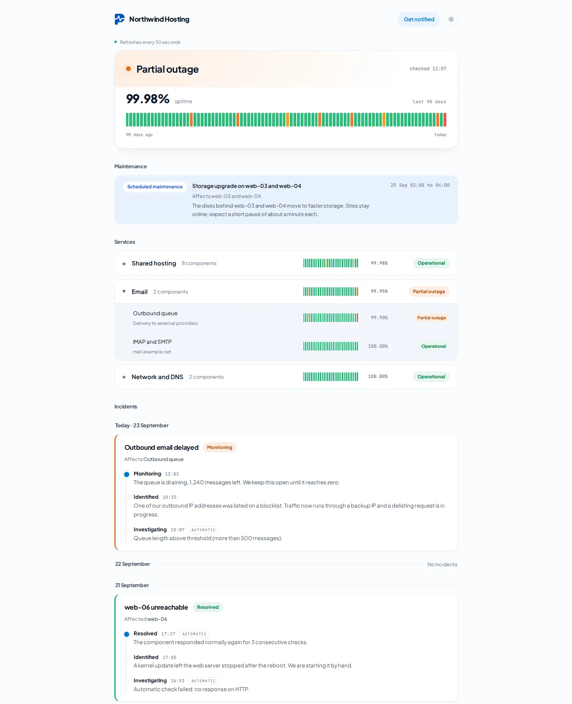

<em>The public page. Every section on it is a switch on the Status page screen.</em>

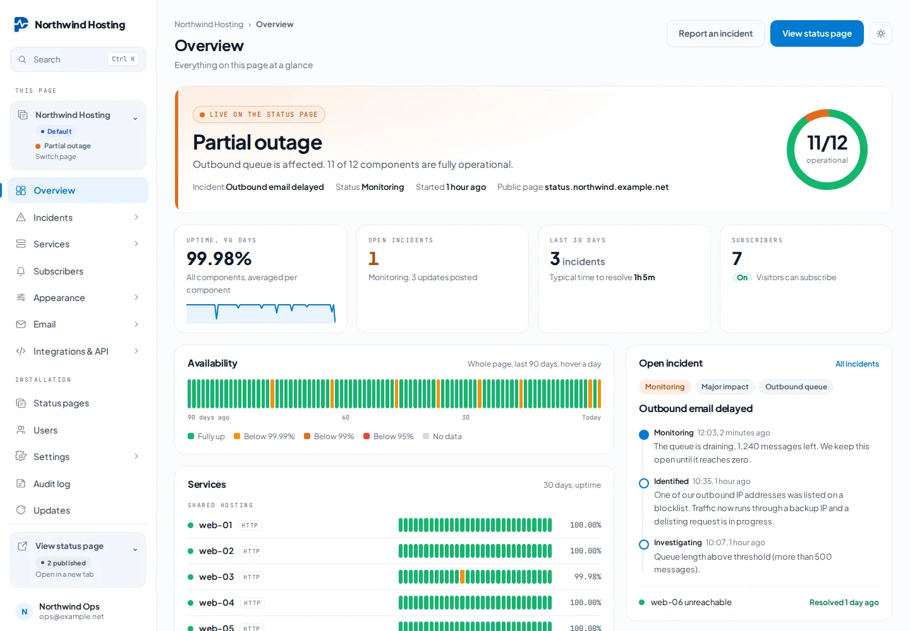

<em>Overview. The first screen after sign in: what the public page says right now, the key
figures, 90 days of availability and the open incident with its updates.</em>

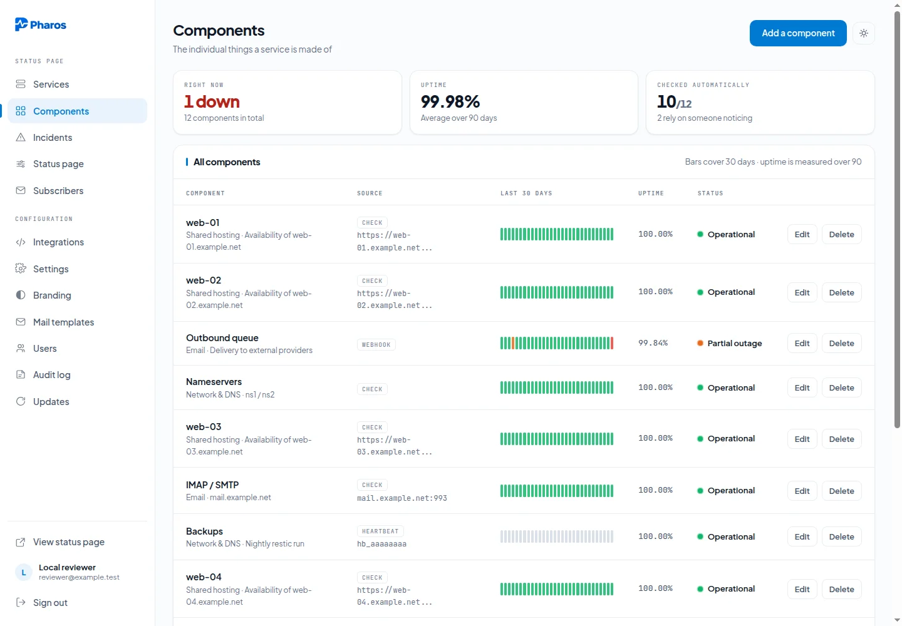

<em>Components. The tiles answer “what is wrong right now” before the table does — including how
many components still rely on someone noticing.</em>

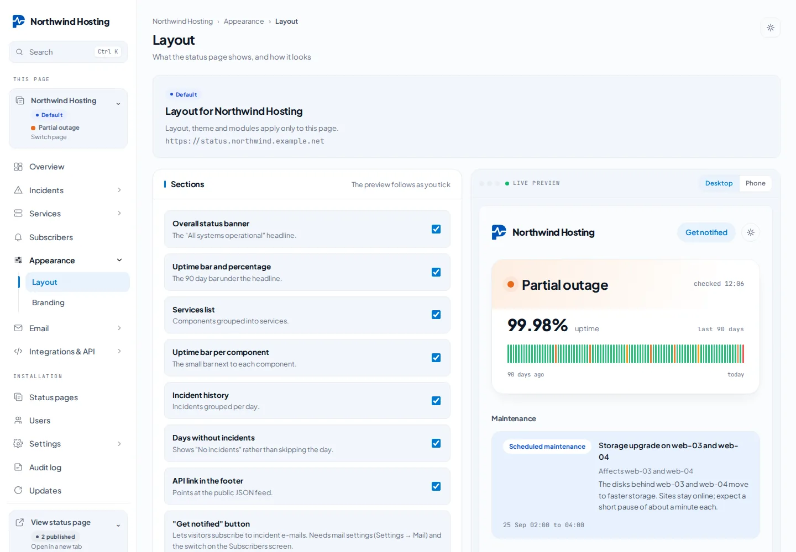

<em>Status page. Tick a section off and it disappears from the preview beside it — the real page,
rendered from values you have not saved yet.</em>

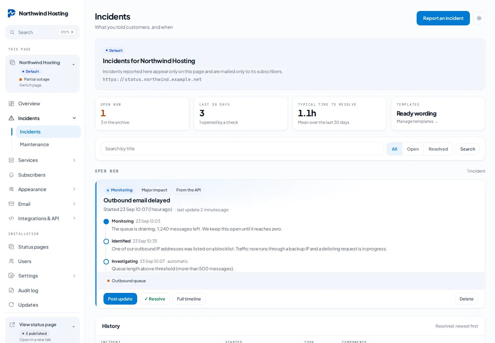

<em>Incidents. Each row says whether a check, the API or a person opened it.</em>


<em>Scheduled maintenance. Pick the components and the window; Pharos announces it ahead, sets
them to Under maintenance at the start and puts them back at the end.</em>


<em>Send out. Add a destination in a few steps, choose which moments it receives, and see at a
glance which one is working, failing or paused.</em>

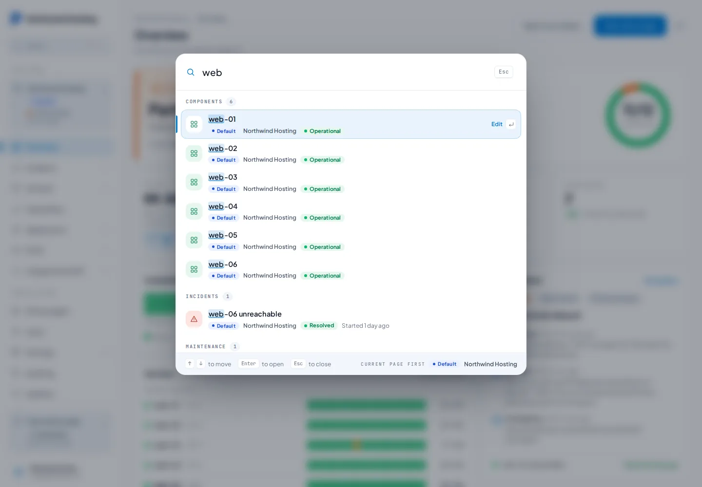

<em>Search. Ctrl K or Cmd K finds pages, components, incidents, maintenance and admin screens,
limited to the pages you hold a role on.</em>

### Several status pages

One installation can run more than one status page, each with its own services, subscribers,
branding, email and integrations, and a role per page for every user.


<em>Status pages. Each card shows the live status, 90 day uptime, open incidents and subscribers.</em>


<em>A second public page with its own brand, next to the Northwind one above.</em>

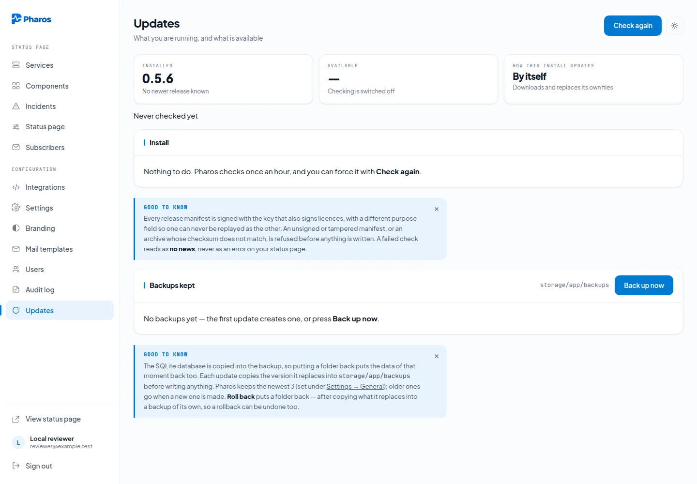

<em>Updates. Signed releases, one click, a backup before anything is written, and roll back if you
change your mind.</em>

---

## Install

| Environment | Guide | Verify before use |
|---|---|---|
| DirectAdmin | [Web installation](https://pharos.solutionmax.net/docs/install/directadmin/) | Web PHP, CLI PHP, permissions and cron |
| cPanel / CloudLinux | [Web installation](https://pharos.solutionmax.net/docs/install/cpanel/) | PHP selector versus CLI binary and cron |
| Plesk | [Web installation](https://pharos.solutionmax.net/docs/install/plesk/) | Document root and scheduled task permissions |
| Docker | [Docker guide](https://pharos.solutionmax.net/docs/docker/) | App and scheduler containers, volumes and proxy |

[Discord setup](https://pharos.solutionmax.net/docs/discord/) ·
[Telegram setup](docs/notifications.md#telegram-notifications) ·
[Signal bridge setup](https://pharos.solutionmax.net/docs/signal/) ·
[Update recovery](https://pharos.solutionmax.net/docs/recovery/)


### cPanel, DirectAdmin, Plesk — or compatible PHP 8.3 hosting

Requires PHP 8.3 or later with the usual Laravel extensions, and either SQLite or MySQL.
No daemon, no worker queue, no root. Two installers, one result: the application lives outside
the web root, only the public files are served by the web server, and one cron line runs
every minute. Both download the same signed release and verify the Ed25519 manifest and the
SHA-256 before unpacking. Rather do it yourself? See [by hand](#by-hand).

#### 1. Without SSH — the web installer

Download [`pharos-install.php`](https://pharos.solutionmax.net/pharos-install.php) and upload it
into the domain's document root (File Manager → `public_html`, or the subdomain's folder). Open
`https://status.example.com/pharos-install.php`. First, unlock it with the private installation
key: the screen shows the file to open in your hosting File Manager. Keep the key for the
administrator form. The installer contains its own logo and needs no external image files.

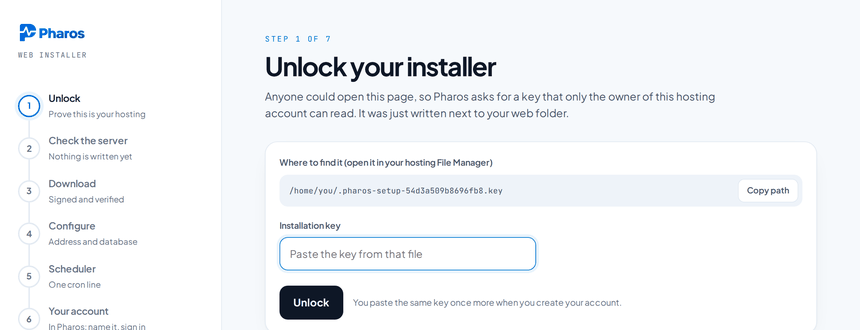

After unlocking, the requirements screen checks whether the host can run Pharos:

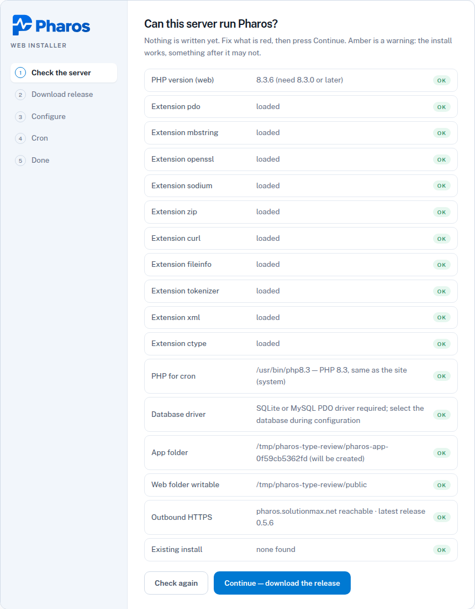

**Download** fetches the release, verifies the signed manifest and the checksum, unpacks the
application into a private `pharos-app-<domain-id>` folder — next to the web root, never inside it — and copies `public/`
into the document root with an `index.php` that points at the app. No document-root change
needed, and `.env` stays out of reach:

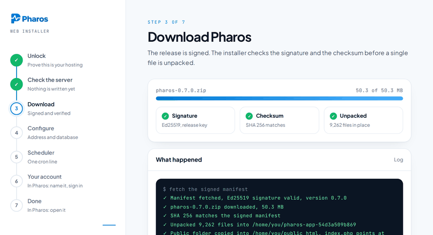

**Configure** asks for the site address and the database. SQLite needs nothing from your host;
MySQL or MariaDB gets a Test connection button. Saving writes `.env` and sets up the database:

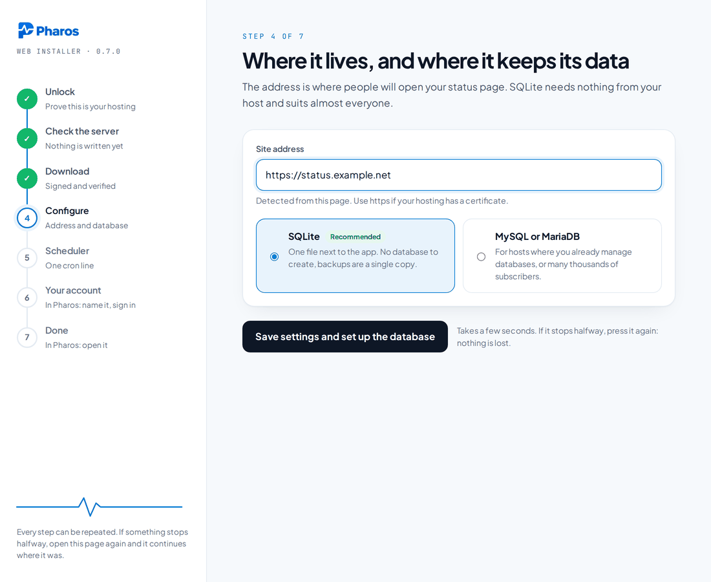

**Scheduler** shows the cron line, with the PHP binary that matches the version the installer
found, and where it goes in cPanel, DirectAdmin and Plesk; it notices the first run by itself.
**Continue to your account** deletes the installer and opens the [setup form](#the-setup-form):

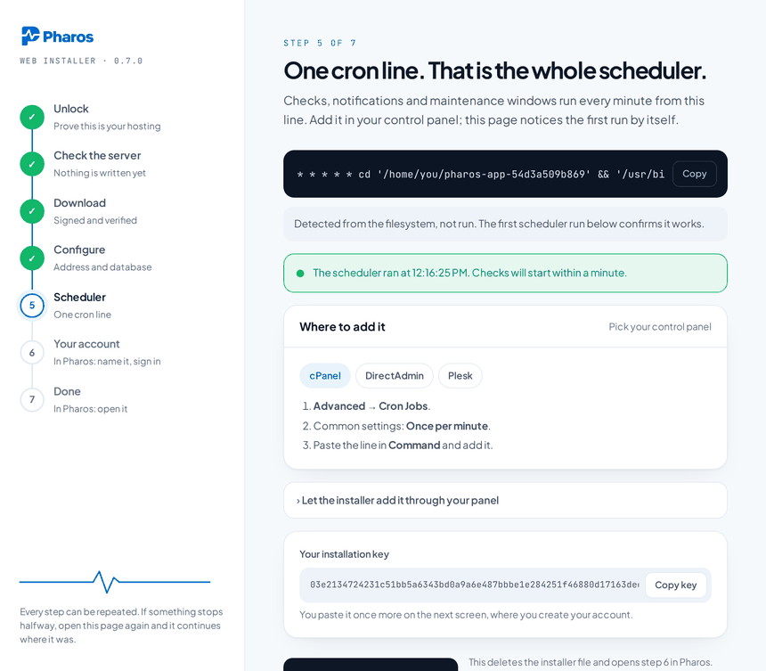

The installer keeps whatever your panel already put in `.htaccess` and adds Pharos's rules
underneath; a half-finished install resumes where it stopped.

#### 2. With SSH — one command

```bash
curl -fsSL https://pharos.solutionmax.net/get | sh -s -- --php --url https://status.example.com
```

Same release, same checks. It installs into a private `pharos-app-<domain-id>` folder (`--dir` to change that), writes
`.env`, migrates, links `storage` and adds the cron line to your crontab — or prints it where
the crontab is not writable, as in DirectAdmin's jailed shell:

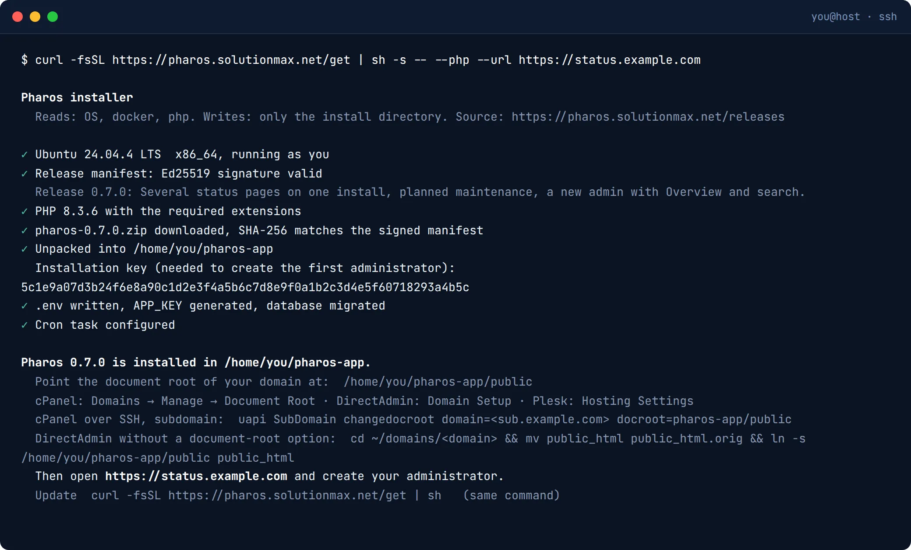

**Then point the document root at `~/pharos-app/public`** — the one step the script leaves to you:

- cPanel: Domains → Manage → Document Root, or over SSH
  `uapi SubDomain changedocroot domain=status.example.com docroot=pharos-app/public`
- DirectAdmin: Domain Setup if your host allows it; otherwise
  `cd ~/domains/status.example.com && mv public_html public_html.orig && ln -s ~/pharos-app/public public_html`
- Plesk: Hosting Settings → Document root → `pharos-app/public`

Updating is the same command again; it hands over to Pharos's own updater, which backs the
current version up first.

#### The setup form

Either way it ends here. The first visit shows one screen: name the status page, create your
administrator using the installation key, done. The form disappears the moment that account exists.

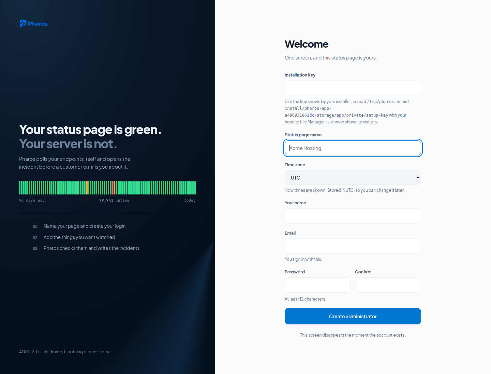

If you would rather not touch a browser, `php artisan pharos:user you@example.com` creates
the first account from the command line — and gets you back in if you ever lock yourself out.

#### The one cron line

Both installers give you the exact line; by hand, add it yourself. This is the entire scheduler:

```
* * * * * cd ~/pharos-app && php artisan schedule:run >/dev/null 2>&1
```

The redirect matters on cPanel and DirectAdmin: without it the panel mails you the
scheduler's output every minute.

In a control panel's cron form the first five stars go in the schedule fields and the rest
in the command field. If the host's default `php` is not 8.3, use the full path
(`/opt/alt/php83/usr/bin/php` on cPanel, `/usr/local/php83/bin/php` on DirectAdmin,
`/opt/plesk/php/8.3/bin/php` on Plesk). Pharos shows a warning in the admin until it sees the
first run.

#### A specific version

Both installers take the newest release unless you pin one: `--version 0.5.0` on the command,
or `pharos-install.php?version=0.5.0` in the browser. Every release on
[the releases page](https://pharos.solutionmax.net/releases/) also has a pre-pinned
`pharos-install-<version>.php`. Pharos never downgrades by itself; use Roll back under Updates.

#### By hand

```bash
git clone https://github.com/solutionmax/pharos.git ~/pharos && cd ~/pharos
composer install --no-dev --optimize-autoloader
cp .env.example .env && php artisan key:generate
touch database/database.sqlite
php artisan migrate --force && php artisan storage:link
# then point the document root at ~/pharos/public, as above, and add the cron line
```

### Docker

The image is `ghcr.io/solutionmax/pharos` — one tag per release (`:0.5.1`) plus `:latest`,
built for `linux/amd64` and `linux/arm64` by GitHub Actions on every release tag.

```bash
git clone https://github.com/solutionmax/pharos.git
cd pharos
cp .env.docker.example .env

# an application key is required; generate one and put it in .env as APP_KEY=
docker run --rm php:8.3-cli php -r "echo 'base64:'.base64_encode(random_bytes(32)).PHP_EOL;"

docker compose up -d
```

`up` pulls the tagged image, or builds it from this checkout when the registry cannot be
reached. Two containers from one image: the application on `php:8.3-apache` (port `8080` by
default, change `PHAROS_PORT` in `.env`), and a second one running `php artisan schedule:work`.
The database is SQLite on a volume; point `DB_CONNECTION` at MySQL if you prefer.

If HTTPS ends at a reverse proxy, set `APP_URL` to the public HTTPS address and
`TRUSTED_PROXIES` to that proxy's IP address or CIDR in `.env`. The proxy must send
`X-Forwarded-Proto: https` and preserve the public host. Recreate the app container
after changing these values so generated links and redirects use HTTPS. Leave
`TRUSTED_PROXIES` empty when connecting directly; do not trust arbitrary forwarded
headers on a publicly reachable backend.

Pin a release with `PHAROS_VERSION=0.5.1` in `.env`. To build the image from your own checkout
instead of pulling it, `docker compose up -d --build`; the `build:` block in `compose.yaml` stamps
the same version into the image.

**Updating** is `docker compose pull && docker compose up -d`. Inside a container the app does not
replace its own files: the Updates screen says the install is *managed from the host* and shows
that command. There is no bundled host updater; the web interface cannot request a container restart.
If `PHAROS_VERSION` is pinned in your Compose environment or `.env`, change it to the target release
before running the command from the directory containing `compose.yaml`. The `curl … /get | sh` installer pulls the same image and only builds it from the
release archive when the registry cannot be reached.

### Check it is alive

```bash
php artisan pharos:check --force
```

Runs every enabled check immediately and prints what it found, instead of waiting for the
scheduler.

---

## How checks work

| Type | What it does | Good for |
|---|---|---|
| **HTTP** | Requests a URL, expects a status code | Websites, APIs, control panels |
| **TCP** | Opens a socket to host:port | Mail, databases, anything without HTTP |
| **Heartbeat** | Waits for *your* job to call in — silence is the failure | Backups, cron scripts, anything you cannot poll from outside |

A check has to fail twice before the component goes red, and has to succeed three times in a row
before the incident closes. That is deliberate: one dropped packet should not publish an outage.

---

## Connecting it to what you already run

The API is **Cachet-shaped**: components and incidents under `/api/v1`, the same
`{"data": …}` envelope and status integers, and `X-Cachet-Token` accepted alongside
`Authorization: Bearer`. Reads need no token. Not there: `ping`, `version`, component
groups, metrics, subscribers and schedules — a Cachet client that starts with `/ping`
will not find them.

```bash
curl -X POST https://status.example.com/api/v1/incidents \
  -H "Authorization: Bearer $TOKEN" \
  -H "Content-Type: application/json" \
  -d '{
        "template":   "server-unreachable",
        "vars":       { "server": "web-06.example.net" },
        "status":     "investigating",
        "components": { "7": "major_outage" }
      }'
```

- **Uptime Kuma** — connect a separately configured API workflow or periodic heartbeat adapter
- **n8n** — both directions, with an HMAC-SHA256 signed outgoing webhook on every incident
- **Zabbix and Grafana** — through the same API, no plugin needed
- **Telegram** — bot notifications to a chat, group or channel; see [Telegram setup](docs/notifications.md#telegram-notifications)
- **Slack** — an incoming webhook per incident update; see [docs/notifications.md](docs/notifications.md)
- **Anything else** — a token and a POST is the whole contract
- **Your visitors** — a *Get notified* button on the status page; confirmed addresses get an
  e-mail per incident update, with one-click unsubscribe. See [docs/subscribers.md](docs/subscribers.md)

Single sign-on and two-factor are covered in [docs/sso.md](docs/sso.md); how licence keys are
issued and verified in [docs/licensing.md](docs/licensing.md).

---

## Updates

Pharos checks for a signed release manifest and shows what is available under **Updates** —
on every installation, paid or not.

On a PHP host it downloads the release, verifies the SHA-256, backs up the current version and
replaces its own files, keeping `.env`, `storage/` and the database. Roll back from the same
screen. On Docker the host pulls the new image: `docker compose pull && docker compose up -d`.

Manifests are signed with **Ed25519** and verified locally. If the release server cannot be
reached, that reads as *no update available* — never as an error.

Every release — what changed, the signed zip, its SHA-256 and a copy of the web installer
pinned to that version — is listed at **[pharos.solutionmax.net/releases](https://pharos.solutionmax.net/releases/)**.
The GitHub Releases here carry the same files as a mirror.

---

## Not implemented yet

Stated plainly rather than described as if it were finished:

- **External probe locations.** Everything is checked from wherever Pharos runs, which is why
  you should host it away from what it is watching.
- **Cachet importer.** Moving from an existing Cachet install is manual for now; existing API
  integrations must be checked against the supported endpoints and payloads.

---

## Licence

**AGPL-3.0-only.** See [LICENSE](LICENSE).

In plain terms: anyone may use, modify and redistribute this, including commercially. If
you modify it **and run it as a service other people can reach**, you have to publish your
modified source. That is the difference between the AGPL and the GPL, and it is the point —
it keeps a hosting company from taking this closed.

If that obligation does not work for your organisation, there is a
[commercial licence](COMMERCIAL-LICENSE.md) that lifts it. Buying one does not take Pharos
away from anyone: every release stays published under the AGPL.

Contributions are welcome — see [CONTRIBUTING.md](CONTRIBUTING.md), which includes the
short contributor licence agreement that makes the dual licence possible.

### Paid, and entirely optional

| | |
|---|---|
| **Free** | Every feature of the core, 1 status page, a "Powered by Pharos" footer credit. |
| **Brand pack** | € 79, one time. Your own logo (light and dark), favicon, your logo in email and editable mail templates, the footer credit removed. Keeps working forever. 1 status page. |
| **Supported** | € 149 per year. The Brand pack included and yours to keep, support by email, and up to 5 status pages, each with its own components, subscribers, branding, email, integrations and user roles per page. |
| **Commercial licence** | From € 599 per year, quoted individually. Everything in Supported, unlimited status pages, and the AGPL publication requirement lifted. |

If a yearly key lapses, the branding stays and existing status pages keep running, but no
new or reactivated pages beyond 1 can be added.

None of it is required to run Pharos. Monitoring, incidents, notifications and updates work
in the free version; the gated parts are the branding (logo, favicon, mail wording, credit)
and status pages beyond the first. Prices are on [pharos.solutionmax.net](https://pharos.solutionmax.net/#pricing).

Licences are verified locally with an Ed25519 signature and may be tied to the domain of
the installation given at checkout. Pharos never phones home to ask
whether you are allowed to run it.

---

<sub>Pharos — a <a href="https://solutionmax.net">SolutionMAX</a> product ·
<a href="https://pharos.solutionmax.net">pharos.solutionmax.net</a> ·
<a href="https://github.com/solutionmax/pharos-site">website and documentation source</a></sub>

## Support the work

Pharos is built and maintained by [SolutionMAX](https://solutionmax.net) and given away.
If it saved you an afternoon:

<a href="https://buymeacoffee.com/solutionmax">
  
</a>

### Optional Signal bridge

`docker/signal-compose.yaml` provides a separate Signal bridge behind HTTPS and
Bearer authentication. It exposes only POST `/v2/send` publicly; linking and account
management remain on loopback port 58080. Use a dedicated host with ports 80/443
available, set its DNS, copy `docker/signal.env.example` to a private env file and
set a random token (`openssl rand -hex 32`, protect the file with `chmod 600`). Then:

```sh
docker compose --env-file /private/path/signal.env -f docker/signal-compose.yaml up -d
```

Link your Signal device using the bridge's loopback API over an SSH tunnel, following
[the bridge's instructions](https://github.com/bbernhard/signal-cli-rest-api#linking-an-existing-device).
In Pharos Integrations choose Signal, enter `https://your-bridge-host/v2/send`,
the linked sender number, recipient number or group ID, and the same Bearer token.
Back up `signal-state` privately. This is an optional self-hosted bridge, not an
integration provided or operated by Signal. Linking a real number and sending a
test notification require your own account.

### Hosting update and cron recovery

The installer can add cron through DirectAdmin or cPanel when your host permits API
access. CloudLinux uses the surrounding hosting panel. Plesk users can use Scheduled
Tasks, or execute `pharos:cron --install` with their CLI PHP if shell access permits it.
A successful task save is followed by verification, but monitoring is only proven
once the scheduler has actually run.

Updates track copied public files in the private storage manifest. Obsolete,
unmodified release files are removed on update/rollback; local files and uploads
remain. If an obsolete tracked file was edited, the update stops for review. Files
copied before the first manifest are not guessed or deleted. PHP shell installs
refuse pinned-version overwrites of existing installs; use Updates and its backups.
MySQL backups remain external: take and verify a consistent database backup before
updating, and restore it together with code when rolling back schema changes.
