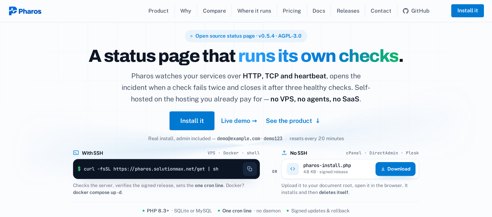
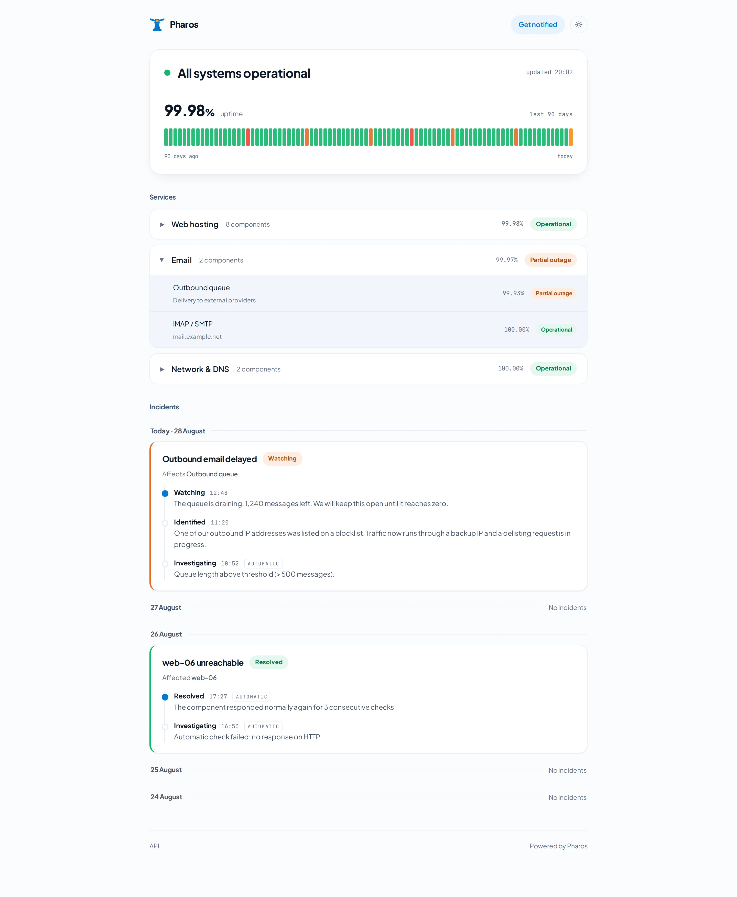
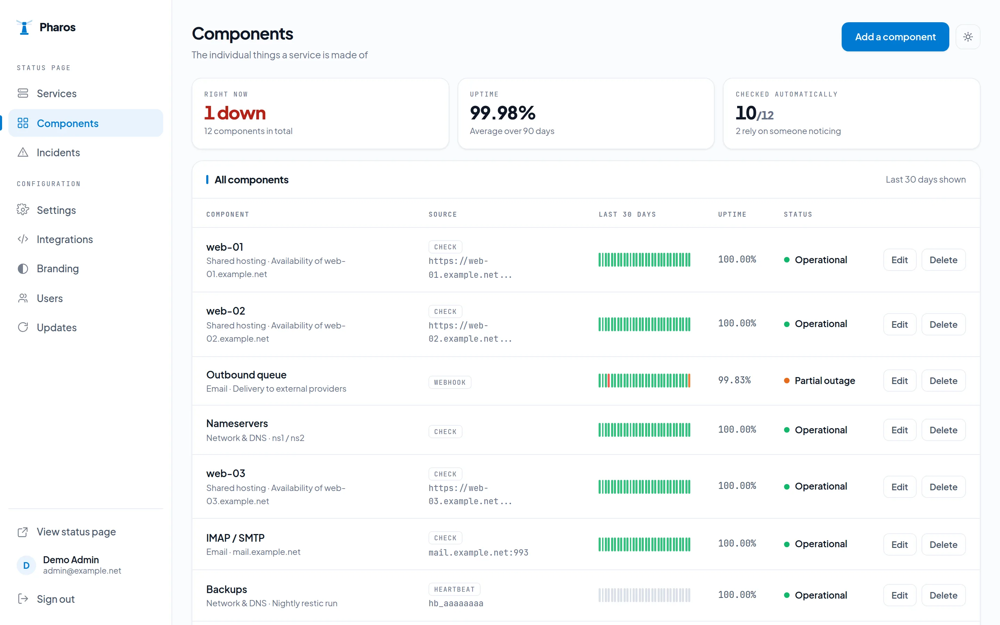
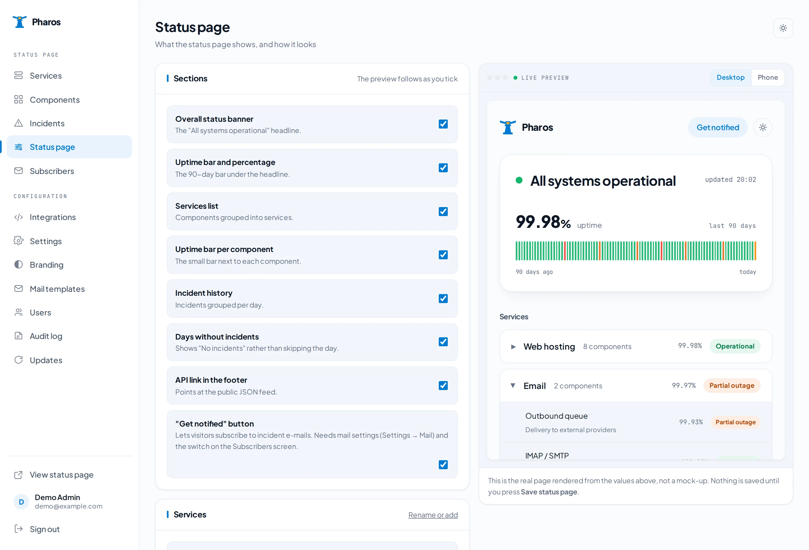
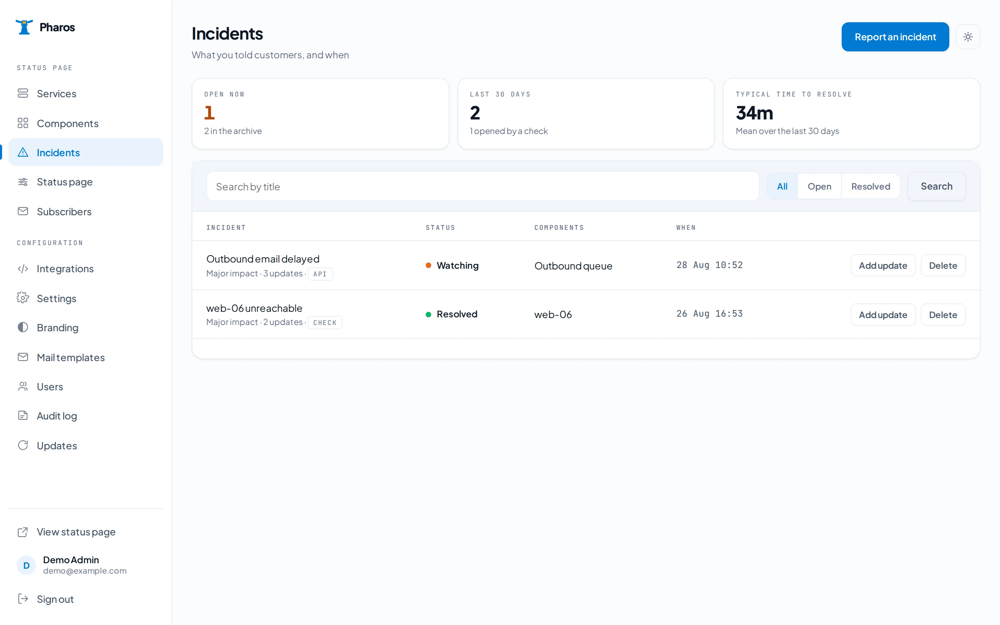
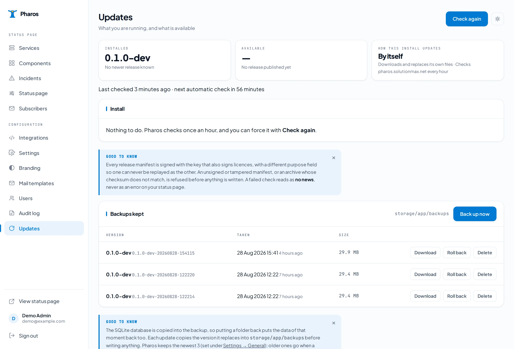

<p align="center">
  <a href="https://pharos.solutionmax.net"></a>
</p>

<p align="center">
  <a href="LICENSE"></a>
  
  
  
  
  
  <a href="https://buymeacoffee.com/solutionmax"></a>
</p>

<p align="center">
  <a href="https://pharos.solutionmax.net">Website</a> ·
  <a href="https://pharos.solutionmax.net/docs.html">Documentation</a> ·
  <a href="#install">Install</a> ·
  <a href="#connecting-it-to-what-you-already-run">API &amp; integrations</a> ·
  <a href="#licence">Licence</a>
</p>

# Pharos

**A self-hosted status page that runs its own checks.**

Every status page you know waits for a human to notice. Pharos polls HTTP endpoints and TCP
ports, listens for heartbeats from jobs it cannot see from outside, and sets component status
without anyone pressing a button. A failing check opens an incident and posts the first update;
a recovered check closes it and posts the closing update.

It is a standard PHP 8.3 application with SQLite or MySQL — so it runs on the cPanel,
DirectAdmin or Plesk account you already pay for, on any other PHP host, or in Docker.
No daemon, no worker queue, no VPS.

---

## Why it exists

- **Cachet 2.x has had no release since 2023.** Nothing checks anything: a component turns red
  because a person made it red, so it is usually still green while the site is down.
- **Cachet 3.x is no longer open source.** Its licence forbids removing its notices and forbids
  distributing it as a standalone product — which rules it out for anyone reselling hosting.
- **One incident, one component.** A hypervisor failure that takes down four customer sites gets
  logged four times, or once while ignoring three of them.

Pharos speaks the Cachet 2.x API on purpose, so scripts written against Cachet keep working.

---

## What is in the box

| | |
|---|---|
| **Checks** | HTTP, TCP and heartbeat. Two failures turn a component red, three healthy checks in a row close the incident. |
| **Incidents** | Opened and closed by the checks themselves, or by hand. One incident can span several components, each with its own status. Templates with `{{variables}}` for the API. |
| **Uptime** | Daily roll-ups into a 90-day bar and a percentage. Days without data are grey and left out of the average — never counted as green. |
| **Public page** | Every section is a switch (banner, uptime bar, services, per-component bars, incident history, empty days, API link), per-service visibility, light and dark theme, and a live preview in the admin that renders the real page from values you have not saved yet. |
| **Subscribers** | A *Get notified* button, double opt-in, one e-mail per incident update, one-click unsubscribe. The four mails are editable Markdown templates. |
| **Integrations** | Cachet 2.x compatible REST API, Uptime Kuma push monitors, n8n in both directions with an HMAC-signed outgoing webhook, Zabbix and Grafana through the API, Slack incoming webhooks. |
| **Updates** | Signed release manifests (Ed25519), one-click install from the admin with an automatic backup, rollback, download and retention. Docker hosts pull the image instead. |
| **Users** | Per-user TOTP two-factor with recovery codes, OpenID Connect single sign-on, roles. |
| **Audit log** | Who changed what and when, filterable, exportable as CSV, with a configurable retention. |
| **Time zone** | Everything stored in UTC, shown in the zone you pick; change it any time. |

---

## What it looks like



<em>The public page. Every section on it is a switch on the Status page screen.</em>



<em>Components. The tiles answer “what is wrong right now” before the table does — including how
many components still rely on someone noticing.</em>



<em>Status page. Tick a section off and it disappears from the preview beside it — the real page,
rendered from values you have not saved yet.</em>



<em>Incidents. Each row says whether a check, the API or a person opened it.</em>



<em>Updates. Signed releases, one click, a backup before anything is written, and roll back if you
change your mind.</em>

---

## Install

### cPanel, DirectAdmin, Plesk — or any PHP 8.3 host

Requires PHP 8.3 or later with the usual Laravel extensions, and either SQLite or MySQL.
No daemon, no worker queue, no root.

```bash
# 1. upload or clone into a directory outside the web root
git clone https://github.com/solutionmax/pharos.git ~/pharos
cd ~/pharos

# 2. dependencies
composer install --no-dev --optimize-autoloader

# 3. configuration
cp .env.example .env
php artisan key:generate
touch database/database.sqlite
php artisan migrate --force
php artisan storage:link

# 4. point the document root at ~/pharos/public
#    cPanel: Domains · DirectAdmin: Domain Setup · Plesk: Hosting Settings → Document root
```

Then open the site in a browser. A fresh install answers every URL with a one-screen setup
form: name the status page, create your administrator, done. The form disappears the moment
that account exists.

If you would rather not touch a browser, `php artisan pharos:user you@example.com` creates
the first account from the command line — and gets you back in if you ever lock yourself out.

Then add **one** cron entry. This is the entire scheduler:

```
* * * * * cd ~/pharos && php artisan schedule:run
```

In a control panel's cron form the first five stars go in the schedule fields and the rest
in the command field.

### Docker

```bash
git clone https://github.com/solutionmax/pharos.git
cd pharos
cp .env.docker.example .env

# an application key is required; generate one and put it in .env as APP_KEY=
docker run --rm php:8.3-cli php -r "echo 'base64:'.base64_encode(random_bytes(32)).PHP_EOL;"

docker compose up -d
```

Two containers from one image: the application on `php:8.3-apache` (port `8080` by
default, change `PHAROS_PORT` in `.env`), and a second one running `php artisan schedule:work`.
The database is SQLite on a volume; point `DB_CONNECTION` at MySQL if you prefer.

### Check it is alive

```bash
php artisan pharos:check --force
```

Runs every enabled check immediately and prints what it found, instead of waiting for the
scheduler.

---

## How checks work

| Type | What it does | Good for |
|---|---|---|
| **HTTP** | Requests a URL, expects a status code | Websites, APIs, control panels |
| **TCP** | Opens a socket to host:port | Mail, databases, anything without HTTP |
| **Heartbeat** | Waits for *your* job to call in — silence is the failure | Backups, cron scripts, anything you cannot poll from outside |

A check has to fail twice before the component goes red, and has to succeed three times in a row
before the incident closes. That is deliberate: one dropped packet should not publish an outage.

---

## Connecting it to what you already run

The API is **Cachet 2.x compatible**: same endpoints, same status integers, and
`X-Cachet-Token` accepted alongside `Authorization: Bearer`. Reads need no token.

```bash
curl -X POST https://status.example.com/api/v1/incidents \
  -H "Authorization: Bearer $TOKEN" \
  -d '{
        "template":   "server-unreachable",
        "vars":       { "server": "web-06.example.net" },
        "status":     "investigating",
        "components": { "7": "major_outage" }
      }'
```

- **Uptime Kuma** — a push monitor calls in; silence turns the component red
- **n8n** — both directions, with an HMAC-SHA256 signed outgoing webhook on every incident
- **Zabbix and Grafana** — through the same API, no plugin needed
- **Slack** — an incoming webhook per incident update; see [docs/notifications.md](docs/notifications.md)
- **Anything else** — a token and a POST is the whole contract
- **Your visitors** — a *Get notified* button on the status page; confirmed addresses get an
  e-mail per incident update, with one-click unsubscribe. See [docs/subscribers.md](docs/subscribers.md)

Single sign-on and two-factor are covered in [docs/sso.md](docs/sso.md); how licence keys are
issued and verified in [docs/licensing.md](docs/licensing.md).

---

## Updates

Pharos checks for a signed release manifest and shows what is available under **Updates** —
on every installation, paid or not.

On a PHP host it downloads the release, verifies the SHA-256, backs up the current version and
replaces its own files, keeping `.env`, `storage/` and the database. Roll back from the same
screen. On Docker the host pulls the new image.

Manifests are signed with **Ed25519** and verified locally. If the release server cannot be
reached, that reads as *no update available* — never as an error.

---

## Not implemented yet

Stated plainly rather than described as if it were finished:

- **External probe locations.** Everything is checked from wherever Pharos runs, which is why
  you should host it away from what it is watching.
- **Cachet importer.** Moving from an existing Cachet install is manual for now; the API
  compatibility means your integrations do not have to move at all.

---

## Licence

**AGPL-3.0-only.** See [LICENSE](LICENSE).

In plain terms: anyone may use, modify and redistribute this, including commercially. If
you modify it **and run it as a service other people can reach**, you have to publish your
modified source. That is the difference between the AGPL and the GPL, and it is the point —
it keeps a hosting company from taking this closed.

If that obligation does not work for your organisation, there is a
[commercial licence](COMMERCIAL-LICENSE.md) that lifts it. Buying one does not take Pharos
away from anyone: every release stays published under the AGPL.

Contributions are welcome — see [CONTRIBUTING.md](CONTRIBUTING.md), which includes the
short contributor licence agreement that makes the dual licence possible.

### Paid, and entirely optional

| | |
|---|---|
| **Brand pack** | One-time. Your logo and favicon, editable mail templates, the "Powered by Pharos" credit removed. |
| **Supported** | Yearly. Support by e-mail from the person who wrote the code, your bug reports first, the Brand pack included and yours to keep. |
| **Commercial licence** | Yearly. The AGPL publication requirement lifted for one organisation. Includes Supported. |

None of it is required to run Pharos. Every feature — including signed one-click updates —
is in the free version; the only gated part is the branding (logo, favicon, mail wording,
credit). What you are paying for is your own branding, support, and not having to publish
your own changes. Prices are on [pharos.solutionmax.net](https://pharos.solutionmax.net/#pricing).

Licences are verified locally with an Ed25519 signature. Pharos never phones home to ask
whether you are allowed to run it.

---

<sub>Pharos — a <a href="https://solutionmax.net">SolutionMAX</a> product ·
<a href="https://pharos.solutionmax.net">pharos.solutionmax.net</a> ·
<a href="https://github.com/solutionmax/pharos-site">website and documentation source</a></sub>

## Support the work

Pharos is built and maintained by [SolutionMAX](https://solutionmax.net) and given away.
If it saved you an afternoon:

<a href="https://buymeacoffee.com/solutionmax">
  
</a>
