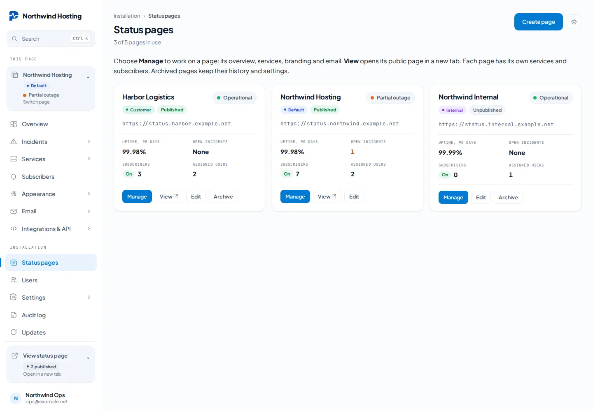
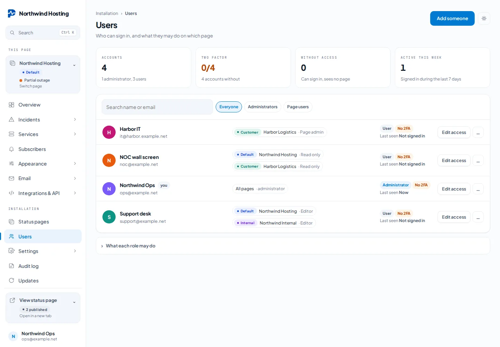
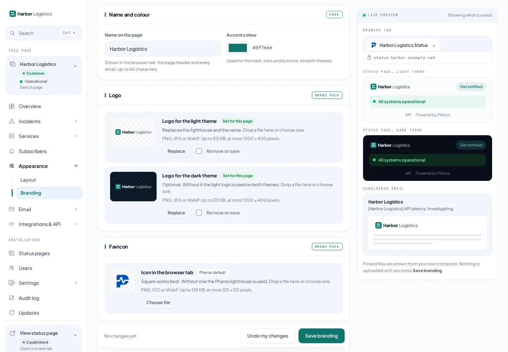
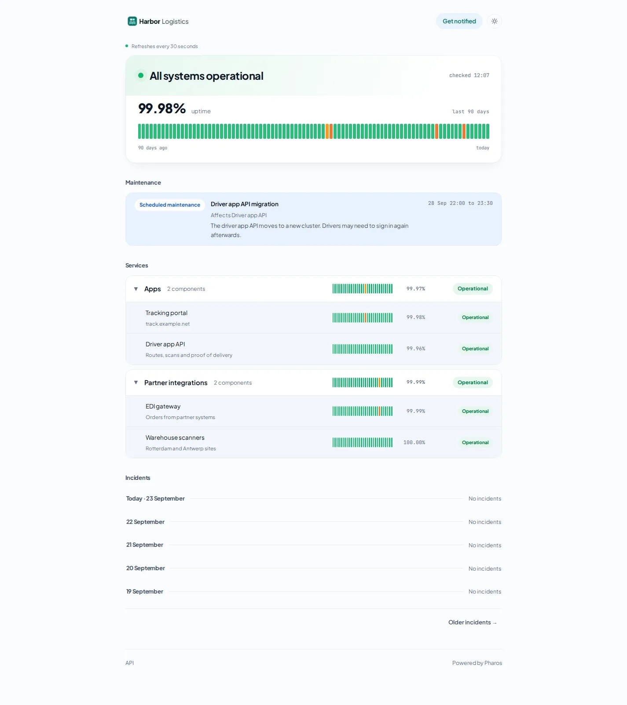
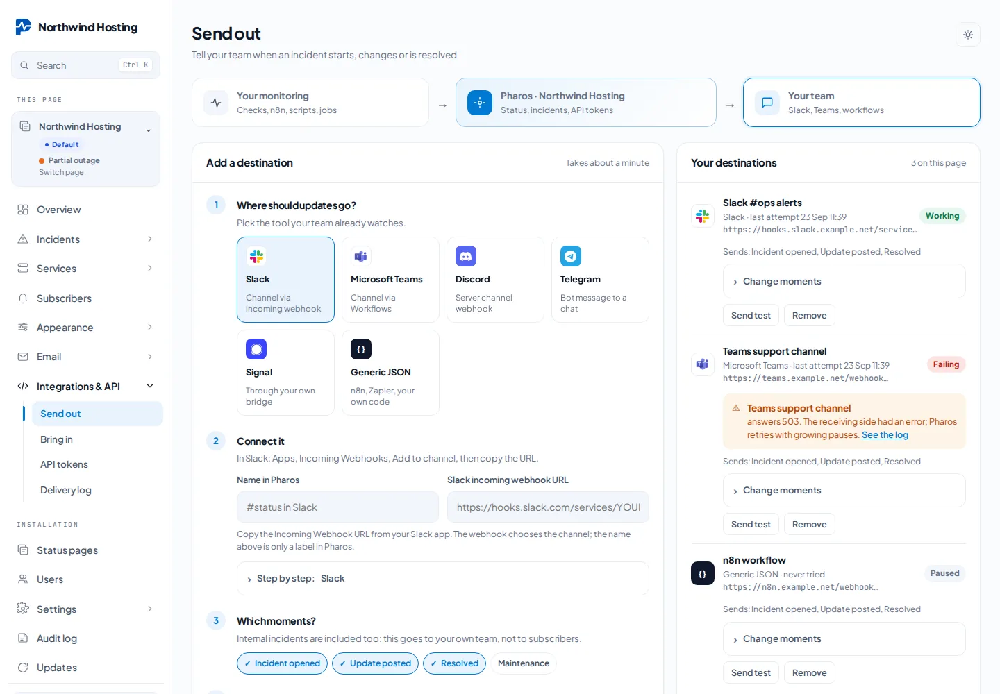
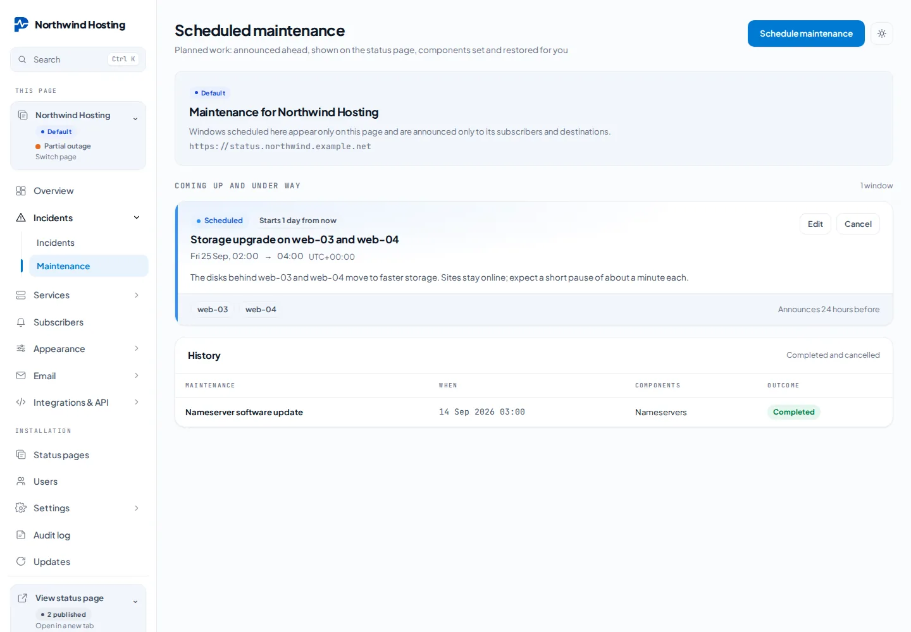

# Multiple status pages

One installation can host independent pages. Components, service groups, incidents,
subscribers, notification destinations and page settings belong to exactly one page.
Checks and history stay with their component. Services cannot be shared or moved
between pages in this release.

## Administration

Open **Status pages** to create or edit a page. New pages have no copied services,
subscribers or branding and default to unpublished. The page selector opens explicit
`/admin/pages/{id}/...` URLs, so separate browser tabs can manage different pages.



*Status pages as cards: live status, 90 day uptime, open incidents, subscribers and assigned users.*

Use the page selector under **This page** in the sidebar to select the page whose services,
branding and email settings are being edited. Choosing a page opens its **Overview**. **View status page** offers the published pages you can manage and opens
the chosen public page in a new tab. Both pickers use the same compact card layout,
with a scrollable list capped at 280 pixels (or 40% of a short viewport). When a menu
has more than five choices, search filters its names and tags. Opening one closes
the other. Draft and archived pages are not offered as public links. The **Status pages** overview shows each full public URL, **Manage**, **View**
(for published pages) and **Edit** (name, publication, domain and assignments).
The main page has a fixed blue **Default** tag. Additional pages can have a short
custom label and one of six tag colours, set when creating or editing the page.
These tags appear in administration only, including the page switcher and email
context card; they do not change public branding or publication status.

Administrators can access all pages. Assign ordinary users from **Users → Page access**
or when creating an account; the page edit screen also supports assignments. Choose one
or several active pages. An empty selection removes all page access. Changes apply to
existing sessions and owned API tokens immediately. Each assignment has its own role:

| Page role | Access |
| --- | --- |
| Read only | View assigned page dashboards and delivery history; no changes or integration credentials. |
| Editor | Manage components, services, incidents, subscribers and notification destinations. |
| Page administrator | Editor rights plus page branding, email, mail templates and page API-token management. |

Installation settings, licences, user administration and creating/publishing/archiving
pages remain reserved for global administrators. A page administrator cannot assign
other users or increase their own rights. New users without assignments see a no-pages
screen. Existing assignments become **Editor** during upgrade. Use **Users → Page
access** to choose a different role for each page. Page access controls administration;
it does not make a published status page private.



*Users with a role per page. The administrator holds all pages; the others only what they were given.*

The default page retains `/` and existing API/subscribe addresses. Other pages use
`/status/{slug}`. Choose the slug carefully: it is immutable after creation to preserve
links in previously sent messages. Display names remain editable.

Archiving preserves all records and stops publication, checks and notifications for
that page. The default page cannot be archived. Unsubscribe links continue working.
Unpublishing a page hides its public routes and suppresses subscriber notifications;
its monitoring can continue while it is a draft. A public page is not an authenticated
customer portal.

## Branding and domains

Select the page before opening **Appearance** (Layout, Branding) or **Email** (Delivery, Templates).
Each page has its own settings and uploaded images. Existing Brand Pack rights apply
installation-wide; new pages start with Pharos defaults, not another customer's identity.





*The same page in public: its own name, logo and colour, separate from Northwind Hosting.*

An optional custom domain must point to this installation, have valid TLS, and be
confirmed by an administrator before use. Pharos does not provision DNS or certificates.
Do not use the central installation host as a page's custom domain. Unknown public
hosts return 404; administration and the API remain on the central `APP_URL` host.

The central display alias redirects to a page's custom domain. Confirmation and
unsubscribe links deliberately use the central installation URL and fixed page slug,
so changing a customer's domain does not invalidate old subscription messages.

## Mail

**Settings → Central mail** is the shared installation transport for account recovery
and pages that inherit it. **Email, Delivery** names the selected page and its public URL,
then selects central transport or custom SMTP. The sender name, sender
address and reply-to can be set per page. Custom SMTP credentials are encrypted with
the installation APP_KEY; keep that key in backups. Empty password input preserves
an existing password. Custom transport failure does not fall back to another sender.

Test email goes to the signed-in administrator using the selected page's configuration.
The mail provider must permit the configured sender domain. The central **Settings**
mail configuration remains responsible for account password resets and inherited
transport. Subscriber signups, confirmations and unsubscribes are independent per page,
including when the same address follows more than one page.

The existing `pharos:check` and `pharos:notify` cron commands process all applicable pages.
No extra cron entry is needed. Outgoing webhook queues also retain their page owner.

## Integrations and delivery history

The Integrations and Email Templates screens show the selected page name, tag and URL.

Integrations is split into four page scoped screens. **Send out** adds and lists
notification destinations (Slack, Microsoft Teams, Discord, Telegram, Signal and Generic
JSON) with their health, and lets editors choose per destination which moments are sent:
incident opened, update posted, resolved and maintenance. Destinations saved before this
choice existed receive every event. **Bring in** gives copy ready settings for n8n,
Uptime Kuma (`POST /api/v1/integrations/kuma/{component}`), scripts and heartbeats.
**API tokens** issues and revokes page tokens (page administrators). **Delivery log**
shows counters and every delivery, filterable by destination, channel and result. The old
`/admin/integrations` address redirects to the matching screen.



Notification destinations (including Slack), signing secrets, tokens, heartbeats and
subscriber templates belong to that page only. Connecting Slack on the default page
does not connect it on another page.

Destination and heartbeat lists use five records per page, the delivery log ten and
token lists ten. Each list has its own pagination parameter. Older records remain
available; pagination does not delete delivery history. No external test message is
sent by viewing these lists or assigning users.

Delivered means a successful send; retrying includes scheduled retries; failed means
delivery stopped after its retry limit. Filters stay selected while browsing older results.
Every result and destination choice remains limited to the selected status page.

## Scheduled maintenance

Editors schedule maintenance per page: title, message, start, end, affected components
and when to announce it (default 24 hours before). The existing minute scheduler
(`pharos:maintenance`) announces the window to confirmed subscribers (only when
subscriptions are on and the page is published and not archived) and to destinations that
chose Maintenance, sets the components to Under maintenance at the start and restores their
previous status at the end unless someone changed it meanwhile. Cancelling stops the window
and restores a running one. The public page shows upcoming and ongoing maintenance.



## API tokens

Legacy `/api/v1/...` endpoints operate on the default page. Other pages use
`/api/v1/pages/{slug}/...` with the same request/response shapes. Integration guides in
the selected page show the correct addresses.

New tokens have an owner and one page. Revoking the owner's page access removes token
access immediately; deleting the owner deletes their tokens. Migrated ownerless tokens
retain default-page access only, preserving existing integrations.

CLI issuance now requires an explicit owner and page:

```sh
php artisan pharos:token "FreeScout readout" --user=admin@example.net --page=2 --scope=read
```

Choose **Read only** for integrations that only fetch status and private incident
information, such as a future FreeScout module. **Read and write** also permits API
changes, bounded by the owner's current page rights. Reducing an owner to read-only
immediately blocks writes from their existing tokens. Tokens cannot change their own
scope or grant access to another page.

New tokens created in the interface default to read-only. Existing tokens retain their
write access for compatibility. Public API reads remain available without a token and
continue to omit private incidents.

## Licensing

Without `multi_pages`, an installation can create only its default page. A signed
`multi_pages` feature enables additional pages. Optional `limits.status_pages` is a
positive integer limiting nonarchived pages; absent means unlimited for a valid
Multi-page key. Plans map to this as follows: Free and Brand pack have 1 page (no
`multi_pages`); Supported carries `brand_pack`, `multi_pages` and `limits.status_pages` = 5;
the Commercial licence carries `brand_pack` and `multi_pages` without a limit (unlimited).
Existing Brand Pack keys retain their current rights. See [licensing](licensing.md#plans).

Vendor-side signing example (never put the private signing key on customer installs):

```sh
php artisan pharos:license:sign customer@example.net \
  --features=brand_pack,multi_pages --status-pages=5 --months=12 \
  --domain=status.example.net --key=/secure/vendor-signing-key.hex
```

Licences bind to the central APP_URL host, not individual customer domains. Expiration,
removal or downgrade blocks creation/reactivation above the current limit. Existing
pages, incident operations, monitoring and subscriptions continue; no data is deleted.
Brand Pack retains the existing perpetual-feature rules.

Prices in Stripe are unchanged (Brand pack € 79 one time, Supported € 149 per year;
the Commercial licence, from € 599 per year, is quoted individually). Supported keys from
the sales portal and commercial keys signed by hand must carry the features and limits above.

## Upgrade and recovery

Back up application files, database, uploads and APP_KEY together. Stop scheduler jobs
and writes while copying an installation for migration. A consistent SQLite backup must
include committed WAL data; use the SQLite backup API, not a live file-only copy.

Run the normal migration command after installing the code. Existing rows and page
settings are assigned to a published default page; ids, monitoring history, users,
legacy API tokens and existing subscription links are preserved. The database must
support the existing Laravel requirements; SQLite and MySQL are exercised in tests.

Rollback means restoring matching application and database backups. Do not run a down
migration after creating extra pages: it deliberately refuses to merge their data.
Preserve/export any data created since the backup before restoring.

## FreeScout follow-up

No FreeScout module is included. Initial feasibility checked on 22 September 2026:
FreeScout supports custom modules using actions/filters, installed under `Modules`
and activated from Manage → Modules. See the official [module development guide](https://github.com/freescout-help-desk/freescout/wiki/Modules-Development)
and [installation instructions](https://github.com/freescout-help-desk/freescout/wiki/FreeScout-Modules).

The smallest useful first module would map each mailbox to a Pharos page and show
service status and public incident links beside tickets. It can fetch published data
from `GET /api/v1/pages/{slug}/components` and `/incidents` without an API token.
Use short caching and a timeout so Pharos downtime does not block ticket handling.
Keep the Pharos base URL administrator-controlled and credentials server-side.

Private incident access can use a page-bound **Read only** token. Customer-specific
mapping and incident creation can follow only if needed. Confirm available sidebar hooks and compatibility against the actual
FreeScout version before implementing the module. No FreeScout installation was changed.
